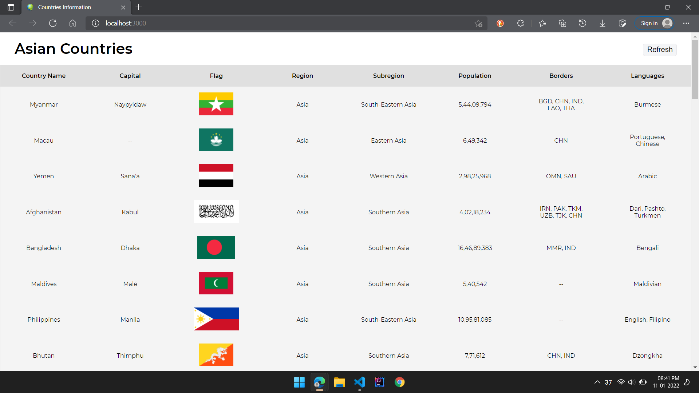
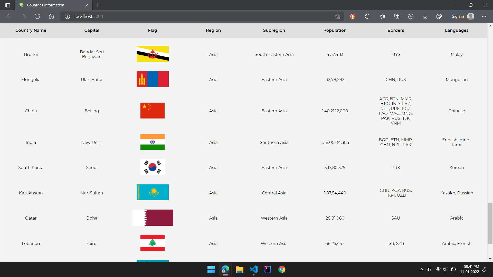
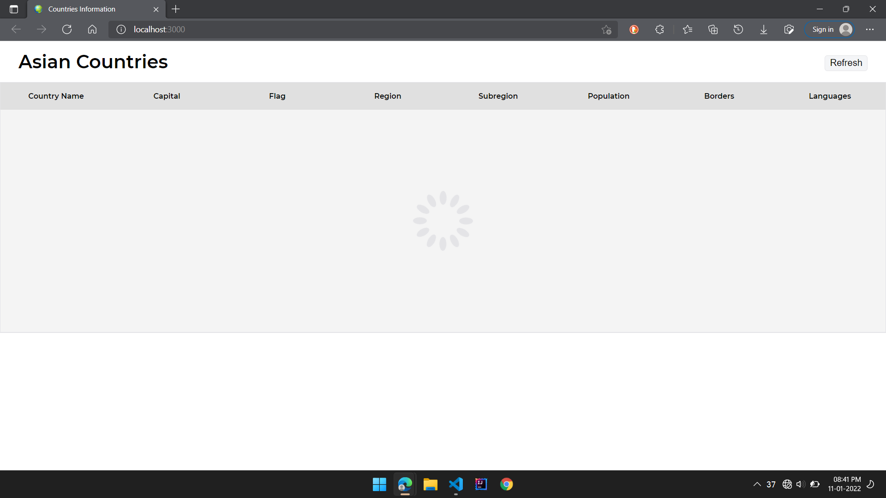

# countries info
Information about Asian countries such as - name, capital, flag, region, subregion, population, borders & languages.

# Screenshots

## Steps to run
1. Clone the repository
2. npm install
3. npm start
